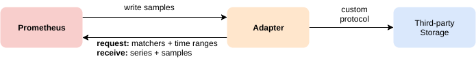

# 存储

Prometheus 包括一个本地磁盘上的时间序列数据库，但也可以选择与远程存储系统集成。

## 本地存储

Prometheus 的本地时间序列数据库在本地存储上以定制的、高效的格式存储数据。

### 磁盘布局

收集的样本分为两小时一组。每两个小时的块由一个目录组成，该目录包含一个或多个块文件，其中包含该时间窗口的所有时间序列样本，以及一个元数据文件和索引文件(将度量名称和标签索引到块文件中的时间序列)。当通过 API 删除序列时，删除记录存储在单独的tombstone 文件中(而不是立即从 chunk 文件中删除数据)。

传入样本的当前块保存在内存中，并不是完全持久的。当 Prometheus 服务器重启时，可以重放预写日志(WAL)来防止崩溃。预写日志以128MB 的格式存放在 wal 目录中。这些文件包含尚未压缩的原始数据；因此，它们比普通的块文件要大得多。Prometheus 将保留至少三个预写日志文件。高流量的服务器可能会保留三个以上的 WA L文件，以保留至少两个小时的原始数据。

一个 Prometheus 服务器的数据目录结构看起来如下：

```
./data
├── 01BKGV7JBM69T2G1BGBGM6KB12
│   └── meta.json
├── 01BKGTZQ1SYQJTR4PB43C8PD98
│   ├── chunks
│   │   └── 000001
│   ├── tombstones
│   ├── index
│   └── meta.json
├── 01BKGTZQ1HHWHV8FBJXW1Y3W0K
│   └── meta.json
├── 01BKGV7JC0RY8A6MACW02A2PJD
│   ├── chunks
│   │   └── 000001
│   ├── tombstones
│   ├── index
│   └── meta.json
├── chunks_head
│   └── 000001
└── wal
    ├── 000000002
    └── checkpoint.00000001
        └── 00000000
```

**请注意，本地存储的一个限制是它没有集群或复制。**因此，在驱动器或节点中断时，它不是可伸缩或持久的，应该像任何其他单节点数据库一样进行管理。建议使用 RAID 来提高存储可用性，建议使用快照作为备份。使用适当的架构，可以在本地存储中保留多年的数据。

另外，外部存储可以通过**远程读写 api** 使用。由于这些系统在耐久性、性能和效率方面差异很大，因此需要仔细评估。

## 压缩

最初两个小时的块最终会在后台压缩成更长的块。

压缩将创建更大的块，其中包含的数据最长可达保留时间的10%，或 31 天，以较短的时间为准。

## 操作方面

如果您的本地存储由于某种原因而损坏，解决这个问题的最佳策略是关闭 Prometheus，然后删除整个存储目录。 注意，这意味着每个块目录将丢失大约两个小时的数据。同样的，普罗米修斯的本地存储并不是长期存储;外部解决方案提供了延长的留存率和数据持久性。

## 远程存储集成

Prometheus 的本地存储仅限于单个节点的可伸缩性和持久性。与其在 Prometheus 中尝试解决集群存储问题，它提供了一组允许与远程存储系统集成的接口

有两种方式集成：

- Prometheus 可以将它摄取的样本以标准格式写入远程 URL。
- Prometheus 可以以标准格式从远程 URL 读取(返回)示例数据。



